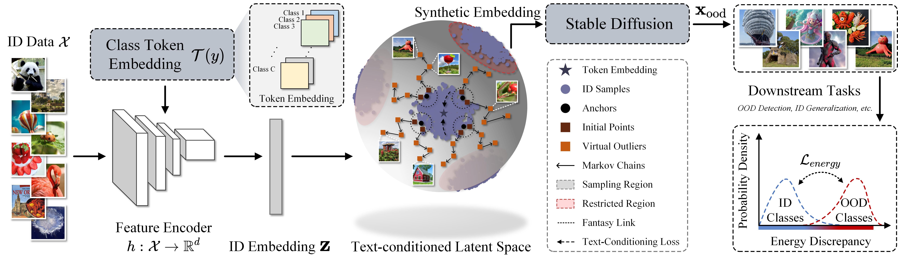
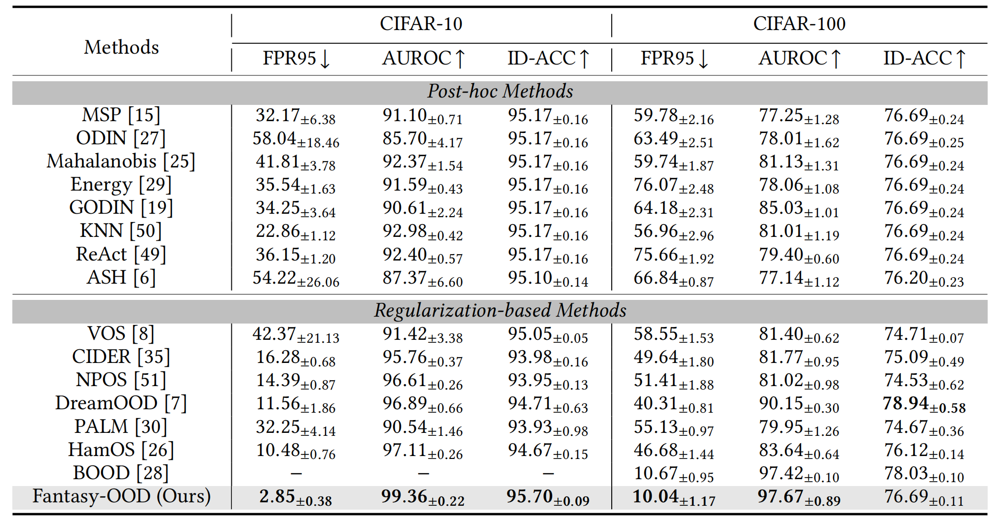
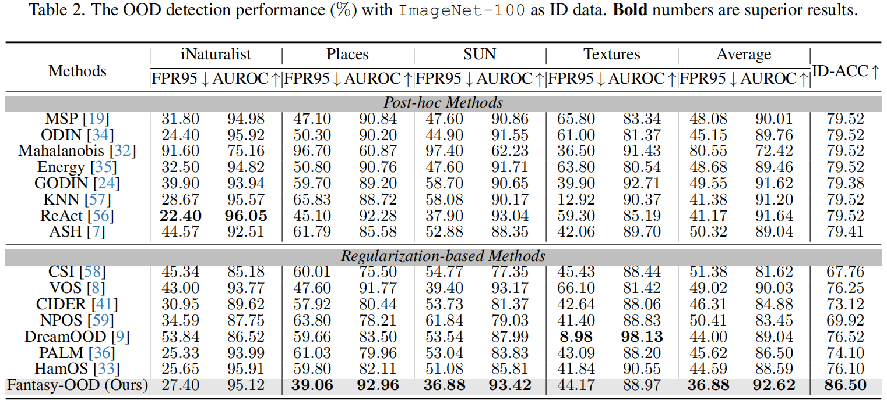
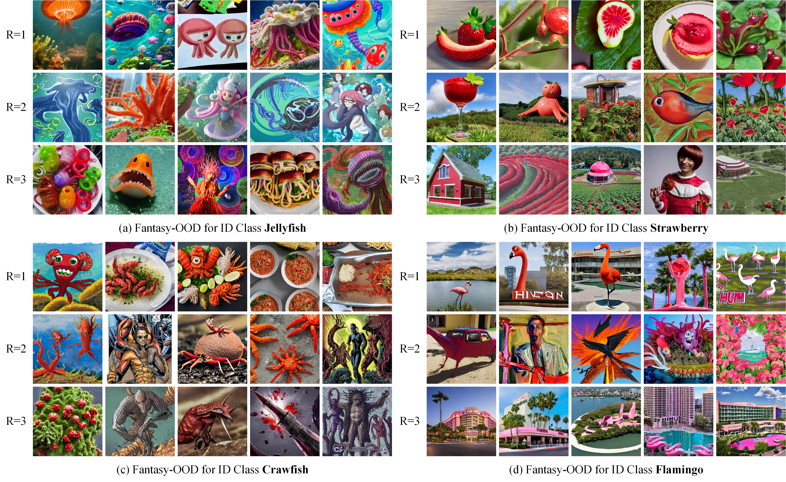
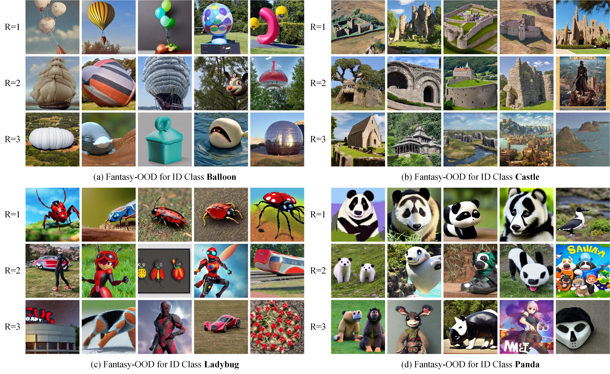

<div align="center">
    <h1>Fantasy Anything: A Journey of Outlier Imagination Across Unknown Spaces</h1>
    <div>
        <a href='https://scholar.google.com/citations?user=U-oCnywAAAAJ&hl=zh-CN&oi=ao' target='_blank'>Ruifan Zhang</a><sup>1,2</sup>
        &emsp;
        <a href='https://scholar.google.com/citations?user=ZCoORgoAAAAJ&hl=zh-CN&oi=ao' target='_blank'>Hai-miao Hu</a><sup>1,2</sup>
        &emsp;
        <a href='' target='_blank'>Yibo Zhou</a><sup>1,2</sup>
        &emsp;
        <a href='' target='_blank'>Xiaokang Zhang</a><sup>1,2</sup>
    </div>
    <div>
        <sup>1</sup>Beihang University, <sup>2</sup>State Key Laboratory of Virtual Reality Technology and Systems
    </div>
    <div>
        <br>
        <p>
            
        </p>
    </div>
    <h2>Framework Illustration</h2>
    <div style="text-align:center">
        
    </div>
    <h2>Experimental Results</h2>
    <div style="text-align:center">
        
        
    </div>
     <h2>Visualization Results</h2>
    <div style="text-align:center">
        
        
    </div>


---

</div>


# **Fantasy-OOD** 

This is the source code accompanying the paper [***Fantasy Anything: A Journey of Outlier Imagination Across Unknown Spaces***](https://arxiv.org/pdf/2309.13415) by Ruifan Zhang, Hai-miao Hu, Yibo Zhou, and Xiaokang Zhang


The codebase is heavily based on [Stable Diffusion](https://github.com/CompVis/stable-diffusion).


## Ads 

Check out our 
* latent-based outlier synthesis papers in IEEE TIP'26 [DOSL](https://github.com/736381914/DOSL_Official)

## Requirements
A suitable [conda](https://conda.io/) environment named `fantasyood` can be created
and activated with:

```python
conda env create -f environment.yml
conda activate fantasyood
```
Please also install [Xformers](https://github.com/facebookresearch/xformers).
You can use `xformers==0.0.13` from [here](https://pypi.org/project/xformers/0.0.13/), and it works successfully.

## Preliminaries
It is tested under Ubuntu Linux 18.04.5 and Python 3.8 environment, and requires some packages to be installed:
* [PyTorch](https://pytorch.org/)
* [scipy](https://github.com/scipy/scipy)
* [numpy](http://www.numpy.org/)
* [sklearn](https://scikit-learn.org/stable/)
* [faiss](https://github.com/facebookresearch/faiss)

## Dataset Preparation

### 1. Dataset Preparation for Large-scale Experiment

#### In-distribution dataset

**ImageNet-100**

* Download the full ImageNet-1k dataset from the official website [here](http://www.image-net.org/challenges/LSVRC/2012/index) and place the training data and validation data in
`./datasets/imagenet/train` and  `./datasets/imagenet/val`, respectively.

* Preprocess the ImageNet-1K training data to get ImageNet-100 by running:

```
python scripts/generate_in100.py --source_folder xxx --target_folder xxx
```
where "--source_folder" is the address of the full ImageNet-1k dataset and "--target_folder" specifies the address of the ImageNet-100 dataset you want to store.

* Preprocess the ImageNet-1K validation data based on the image-to-class mapping provided in `scripts/val_category.txt`, and organize it into the ImageNet-100 format by running:

```python
python scripts/deal_txt.py
```

#### Out-of-distribution dataset

We have curated 4 OOD datasets from [iNaturalist](https://arxiv.org/pdf/1707.06642.pdf), [SUN](https://vision.princeton.edu/projects/2010/SUN/paper.pdf), [Places](http://places2.csail.mit.edu/PAMI_places.pdf), and [Textures](https://arxiv.org/pdf/1311.3618.pdf), and de-duplicated concepts overlapped with ImageNet-100.

For iNaturalist, SUN, and Places, we have sampled 10,000 images from the selected concepts for each dataset, which can be download via the following links:

```bash
wget http://pages.cs.wisc.edu/~huangrui/imagenet_ood_dataset/iNaturalist.tar.gz
wget http://pages.cs.wisc.edu/~huangrui/imagenet_ood_dataset/SUN.tar.gz
wget http://pages.cs.wisc.edu/~huangrui/imagenet_ood_dataset/Places.tar.gz
```

For Textures, we use the entire dataset, which can be downloaded from their [original website](https://www.robots.ox.ac.uk/~vgg/data/dtd/).

Please put all downloaded OOD datasets into `./datasets/large_OOD_dataset`.

### 2. Dataset Preparation for CIFAR Experiment 

#### In-distribution dataset

**CIFAR-10 and CIFAR-100**

* Both datasets are included in PyTorch, and the dataloader will automatically download them when the program is run for the first time.

#### Out-of-distribution dataset

We provide links and instructions to download each OOD dataset:

* [SVHN](http://ufldl.stanford.edu/housenumbers/test_32x32.mat): download it and place it in the folder of `datasets/small_OOD_dataset/SVHN`. Then run `python utils/select_svhn_data.py` to generate test subset.
* [Textures](https://www.robots.ox.ac.uk/~vgg/data/dtd/download/dtd-r1.0.1.tar.gz): download it and place it in the folder of `datasets/small_OOD_dataset/dtd`.
* [Places365](http://data.csail.mit.edu/places/places365/test_256.tar): download it and place it in the folder of `datasets/small_OOD_dataset/places365/test_subset`. We randomly sample 10,000 images from the original test dataset. We provide the file names for the images that we sample in `utils/places365_test_list.txt`. Place `places365_test_list.txt` in the same directory as the places365 dataset, and run `python utils/select_places365_data.py` to filter the subset based on `places365_test_list.txt`.
* [LSUN-C](https://www.dropbox.com/s/fhtsw1m3qxlwj6h/LSUN.tar.gz): download it and place it in the folder of `datasets/small_OOD_dataset/LSUN`.
* [LSUN-R](https://www.dropbox.com/s/moqh2wh8696c3yl/LSUN_resize.tar.gz): download it and place it in the folder of `datasets/small_OOD_dataset/LSUN_resize`.
* [iSUN](https://www.dropbox.com/s/ssz7qxfqae0cca5/iSUN.tar.gz): download it and place it in the folder of `datasets/small_OOD_dataset/iSUN`.

For example, run the following commands in the **root** directory to download **LSUN-C**:

```python
cd datasets/small_OOD_dataset
wget https://www.dropbox.com/s/fhtsw1m3qxlwj6h/LSUN.tar.gz
tar -xvzf LSUN.tar.gz
```

### 3. Dataset Preparation for Evaluating Model Generalization

Please download [IMAGENET-A](https://github.com/hendrycks/natural-adv-examples) and [IMAGENET-V2](https://github.com/modestyachts/ImageNetV2) and process the dataset by running (you need change the address of the datasets on your own):
```python
python scripts/process_imagenetv2_and_a.py
```

Overall, the directory structure should be modified to match:

    └── datasets
         |
         ├── CIFAR10
         ├── CIFAR100
         ├── ImageNet_100
         |	  ├── train
         |    └── val
         ├── ImageNet_A
         |    └── imagenet-a_processed
         ├── ImageNet_V2
         |    └── imagenetv2_processed
         ├── large_OOD_dataset
         |	  |
         |    ├── iNaturalist
         |    |	   └── images
         |	  |		     ├── ...
         |    ├── dtd
         |    |    ├── images
         |    |    |    ├── ...
         |    |    ├── imdb
         |    |    └── labels
         |    |
         |    ├── Places
         |    |    └── images
         |	  |		     ├── ...
         |    └── SUN
         |         └── images
         |	  		     ├── ...
         └── small_OOD_dataset
              |
              ├── SVHN
              |	   └── test_32x32.mat
              ├── dtd
              |    ├── images
              |    |    ├── banded
              |    |    |    ├── banded_0002.jpg
              |    |    | 	 ├── ...
              |    |    ├── ...
              |    ├── imdb
              |    └── labels
              |
              ├── places365
              |    └── test_subset
              |         ├── Places365_test_00000013.jpg
              |         ├── ...
              ├── LSUN
              |    └── test
              |         ├── 0.png
              |         ├── ...
              ├── LSUN_resize
              |    └── LSUN_resize
              |         ├── 0.jpg
              |         ├── ...
              └── iSUN
                   └── iSUN_patches
                        ├── 0.jpeg
                        ├── ...

## Training

**1. Extract the text anchors from the stable diffusion model**

We have pre-extracted the text anchors for the ID datasets: `token_embed_in100.npy` for ImageNet-100, `token_embed_c10.npy` for CIFAR-10, and `token_embed_c100.npy` for CIFAR-100.

For a specific dataset, you only need to replace the corresponding class names. For example, please execute the following in the command shell on CIFAR-10:

```python
python scripts/get_anchor_cifar10.py
```

After running, it will generate text anchors for text-conditioned latent space learning.

**2. Learning the text-conditioned latent space**

Please execute the following in the command shell on ImageNet-100:
```python
python scripts/pretrain_in100.py
```
Please execute the following in the command shell on CIFAR-10:

```python
python scripts/pretrain_cifar10.py
```

Please execute the following in the command shell on CIFAR-100:

```python
python scripts/pretrain_cifar100.py
```
After training, it will generate ID feature embeddings for outlier/inlier embedding sampling.

* Pretrained models for [ImageNet-100](https://drive.google.com/file/d/1wiHvkMh4DTI4hbtqgOPTF4YSNzGsSbEP/view?usp=sharing), [CIFAR-10](https://drive.google.com/file/d/1y-2CbO2Kr8P4mxeLO7ZIVVwXabsqM27m/view?usp=sharing) and [CIFAR-100](https://drive.google.com/file/d/1ctBb8y5LmZrh9zqEw_Rml9Wh1Ys-F5WC/view?usp=sharing).
* Pretrained ID embeddings for [ImageNet-100](https://drive.google.com/file/d/1iUvrDJMlhTV7szsACqsBpZRs4VermBKa/view?usp=sharing), [CIFAR-10](https://drive.google.com/file/d/1gRktNTdPF9ihTz4qLWHgbLywQKnf2Nue/view?usp=sharing) and [CIFAR-100](https://drive.google.com/file/d/1w-e4M6aerHsryqzHx7-uWjfxEMHsZjOh/view?usp=sharing).

**3. Generate the inlier/outlier embeddings**

Please execute the following in the command shell on ImageNet-100:
```python
python scripts/get_embed_in100_with_ham.py --shift 0
```
* "--shift" controls the sampling type ("0" for outlier sampling and "1" for inlier sampling).

Please execute the following in the command shell on CIFAR-10:

```python
python scripts/get_embed_cifar10_with_ham.py --shift 0
```

Please execute the following in the command shell on CIFAR-100:

```python
python scripts/get_embed_cifar100_with_ham.py --shift 0
```

After this step, you will see the generated inlier/outlier embedding in the root directory.

* Pretrained embeddings: [inliers for ImageNet-100](https://drive.google.com/file/d/1SSMOGNL7tklP3e9-KfM7z8xYFVKIhm8j/view?usp=sharing), [outliers for ImageNet-100](https://drive.google.com/file/d/1jlsRQOaSY36UstFP3NffExenVD7FrW3t/view?usp=sharing), [outliers for CIFAR-10](https://drive.google.com/file/d/13vAGF3mXqryBkM8OcnoAvUrRbYgGnUxd/view?usp=sharing) and [outliers for CIFAR-100](https://drive.google.com/file/d/1D5xqQDa2sOwOWNj177er08GxSJioOrKq/view?usp=sharing).

**4. Synthesizing outliers in the pixel space**

First, please download the Stable Diffusion 1.4 model [here](https://huggingface.co/CompVis/stable-diffusion-v-1-4-original/tree/main) and place it in the folder of `./snapshots`.

Please execute the following in the command shell on different datasets:

```python
python scripts/fantasy_ood.py --plms \
--n_iter 1306 --n_samples 3 \
--outdir ./snapshots/txt2img-samples-in100-demo \
--loaded_embedding ./in100_outlier_all_cohesion.npy\
--ckpt ./snapshots/sd-v1-4.ckpt \
--id_data in100 \
--skip_grid
```
* "--loaded_embedding" means the address of the saved inlier/outlier embeddings obtained by the previous step.
* "--outdir" denotes the address you want to save the generated outlier images.
* "--n_iter"/"--n_samples" control the number of steps for generation and the number of images you generate in each step.
* "--id_data" can be chozen between in100, cifar10, and cifar100.
* For generating 100K images, you can specify the n_iter and n_samples such as n_iter=25,000 and n_samples=4. Consider generating on multiplt GPUs for speed up.
* Generated images: [outlier image for IN100](), [inlier image for IN100]() and [outlier image for cifar100](). (Sorry for the delay in releasing the generated images, as I couldn’t find a free drive with sufficient storage.)

**5. Training with the generated outliers in the pixel space**

Please execute the following in the command shell for OOD detection on ImageNet-100:
```python
python scripts/train_ood_det_in100.py --my_info samples --load xxx
```
* "--my_info" denotes the name of the folder that contains the generated datasets in Step 4.

Note that in order to save time, we use a [pretrained model](https://drive.google.com/file/d/10wJhuIhTZVhqpJB9yPT8MdVoLjaB3Hyu/view?usp=sharing) for initialization, which is trained using the cross-entropy loss.

Please execute the following in the command shell for OOD detection on CIFAR-10:

```python
python scripts/train_ood_det_cifar10.py --my_info samples
```

Please execute the following in the command shell for OOD detection on CIFAR-100:
```python
python scripts/train_ood_det_cifar100.py --my_info samples
```
Here, the models for CIFAR-10/CIFAR-100 are trained from scratch.

* Pretrained models: [ImageNet-100](https://drive.google.com/file/d/11lOABMqbJzJEGkbJTUP97YbJ1UNw4xJ6/view?usp=sharing), [CIFAR-10](https://drive.google.com/file/d/1mYbPZvj7213tCT-F8UnGAPn-PruzL74U/view?usp=sharing) and [CIFAR-100](https://drive.google.com/file/d/1f47QJsKFB7nBmoM7EElXyC8INB7Qy_4A/view?usp=sharing).

**6. Training with the generated inliers in the pixel space**

Please execute the following in the command shell for generalization on ImageNet-100:
```python
python scripts/train_gene_in100.py --my_info samples_inlier
```
* "--my_info" denotes the name of the folder that contains the generated datasets in Step 4.
* Pretrained models: [ImageNet-100](https://drive.google.com/file/d/1t4RD7QsZ9_fgB70SPEpLGK0H2l4HZ5wg/view?usp=sharing).

## Test-time OOD detection
Please execute the following in the command shell with ImageNet-100 as in-distribution:
```python
python scripts/test_ood_in100.py --load xxx
```
where "--load" specifies the address of the saved models.  

Please execute the following in the command shell with CIFAR-10 as in-distribution:

```python
python scripts/test_ood_cifar10.py --load xxx
```

Please execute the following in the command shell with CIFAR-100 as in-distribution:
```python
python scripts/test_ood_cifar100.py --load xxx
```
## Test-time ID generalization
Please execute the following in the command shell with ImageNet-100:
```python
python scripts/test_ood_in100_robustness.py --load xxx
```

where "--load" specifies the address of the saved models.  


## Citation ##
If you found any part of this code is useful in your research, please consider citing our paper:

```python
  @inproceedings{,
      title={Fantasy Anything: A Journey of Outlier Imagination Across Unknown Spaces}, 
      author={Ruifan Zhang and Hai-miao Hu and Yibo Zhou and Xiaokang Zhang},
      booktitle={},
      year = {}
}
```
